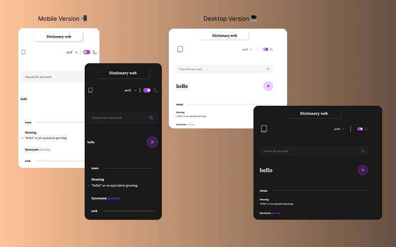

# 📖 Dictionary Web App

---

## 🚀 Project Description

**Dictionary Web App** is a minimalist and fast web application designed to help you instantly find the **meaning** and **pronunciation** (in audio format) of any English term.

Its main goal is to **efficiently solve the need to look up a word's definition**, offering a clean interface and a fluid user experience, without requiring any installation.

---
---

## 📸 Screenshot

Here's a look at the application in action!

## ✨ Technologies Used

This project was developed using a modern and lightweight *stack*:

* **React:** For building the user interface declaratively and efficiently.
* **Vite:** As an ultrafast *bundler* for the development environment and final build.
* **CSS:** For design and styling.

---

## 💻 Usage Guide (No Installation Required!)

As a web application, the way to use it is simple and **does not require any kind of** local **installation** or dependencies.

1. **Access the Application:** Visit the application URL [Dictionary Web](https://dictionary-app-one-gamma.vercel.app/).
2. **Search for the Word:** In the search field, type the English word whose meaning you want to know.
3. **Get Results:** Press `Enter` or click the search button. The application will display:
    * The **definition** or definitions of the term.
    * An **audio player** to hear the correct pronunciation.

---

## 📄 License

This project is under the **[MIT License]**. See the `LICENSE` file for more details.

---

## 📧 Contact

* **Author:** PD - Developer
* **GitHub:** [PD - Dev](https://github.com/Pablo-Zallio-Dev)